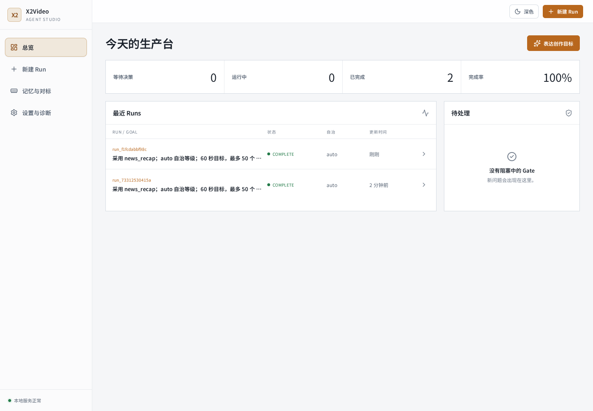

# X2Video

**输入一个内容方向，自动找到素材、写成口播，并生成可直接审片的竖屏短视频。**

https://github.com/user-attachments/assets/90e42a32-74dc-4e23-ba29-7dbdc36e5b94



X2Video 把每天重复的“找选题 → 筛素材 → 写稿 → 配音 → 加字幕 → 合成”串成一条自动化流程。演示用的是 AI 新闻，但内容并没有写死：改掉关键词和 Prompt，也可以用来做动漫、游戏或其他垂直领域的资讯视频。

最终会得到一套完整的发布素材：

- 1080 × 1920 竖屏 MP4
- 封面、标题、简介和标签建议
- 候选素材、口播稿与质检结果

## 两种内容接入方式

| 方式 | 适合谁 | 费用 |
| --- | --- | --- |
| SuperGrok 登录 | 已有 SuperGrok / X Premium+ 会员，希望快速开始 | 使用订阅 Token 额度，不消耗 X Developer API 点数 |
| X 官方 MCP | 有 X Developer Token，希望走官方按量接口 | 按 X API 用量计费；仓库已保留可替换的数据源接口 |

SuperGrok 路径可以直接在浏览器中完成授权：

```bash
x2video auth login
```

账号凭证只保存在本机，不会写入仓库。

## 工作方式

```text
输入主题
  → 抓取并筛选近期内容
  → 生成中文口播与画面脚本
  → 配音、字幕、卡片与封面
  → 合成视频并自动质检
  → 人工确认后发布
```

Agent Studio 用来查看每次任务、挑选素材、修改脚本、检查成片，并从失败步骤继续运行。自动化负责重复劳动，选什么和发不发仍由人决定。

## 快速体验

需要 Python 3.11+、FFmpeg 和 Chromium。

```bash
git clone https://github.com/asashiki/X2Video.git
cd X2Video

python -m venv .venv
# Windows: .venv\Scripts\activate
# macOS / Linux: source .venv/bin/activate

pip install -e ".[dev]"
x2video doctor
x2video agent run --goal "做一条 60 秒以内的今日 AI 新闻" --autonomy auto
x2video studio
```

打开终端显示的地址即可进入 Studio。离线 Demo 使用仓库内的固定素材，不需要 API Key；连接 SuperGrok 后，可以抓取实时内容并运行完整生产流程。

## 更多资料

- [三分钟演示](docs/demo/three-minute-demo.md)
- [架构说明](docs/architecture-agent-studio.md)
- [验证报告](docs/demo/verification-report.md)
- [配置示例](x2video.example.toml)
