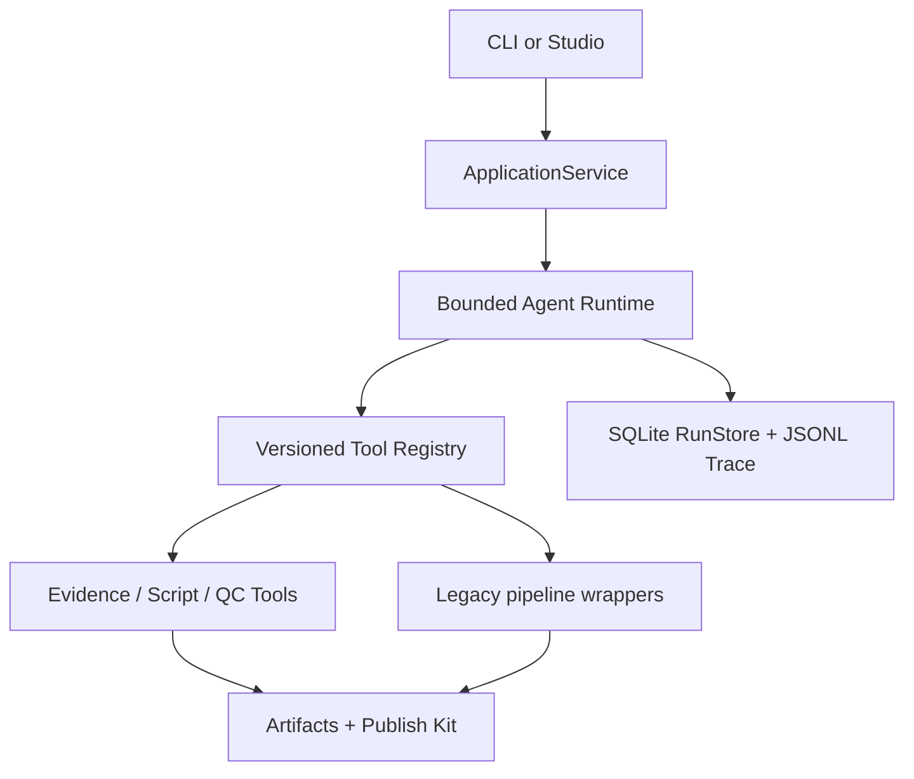
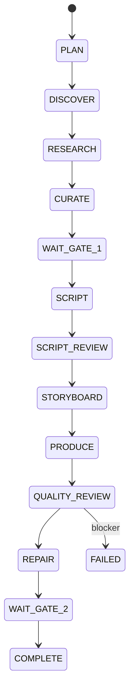

# Agent Studio v0.2 architecture

## Boundary

X2Video remains a Python CLI product. The new Content Director is a bounded planner and state machine, not a free-form multi-Agent chat system. Deterministic Tools own source I/O, rendering, FFmpeg inspection, file writes and database updates. CLI, API, Worker and React Studio all call `ApplicationService`.

The React client contains presentation and input state only. It never computes Curation, edits persisted Run state directly or invents progress. Long runs execute in an independent Python Worker; SSE and polling expose the durable event stream.

## Run state

`supervised` waits at both Gates, `assisted` skips Gate 1 and waits at Gate 2, and `auto` skips both. Pause, cancel, retry, gate decisions, fork and Replay operate on persisted task/event state. A succeeded idempotency key is never executed twice.

## Trust and safety boundary

- Candidate, Thread, Quote and linked text is wrapped as untrusted data and scanned for instruction-like content.
- Events, payloads and JSONL Trace are redacted before persistence.
- Trace stores decisions, evidence, risks, costs and actions; hidden reasoning is neither requested nor saved.
- Media remains on disk; the SQLite control plane stores paths, hashes, dependencies and versioned metadata.
- Repair is limited to two rounds. Unresolved QC blockers fail the Run and cannot reach `COMPLETE`.

## Storage migration

Migration 1 creates the v0.2 control-plane tables. Migration 2 adds `runs.is_paused` for databases created by early v0.2 builds. Migrations are additive and do not move or rename the v0.1 `work/YYYY-MM-DD/` or `final/` outputs. See [v0.2 migration and rollback](./migrations/v0.2.md).
